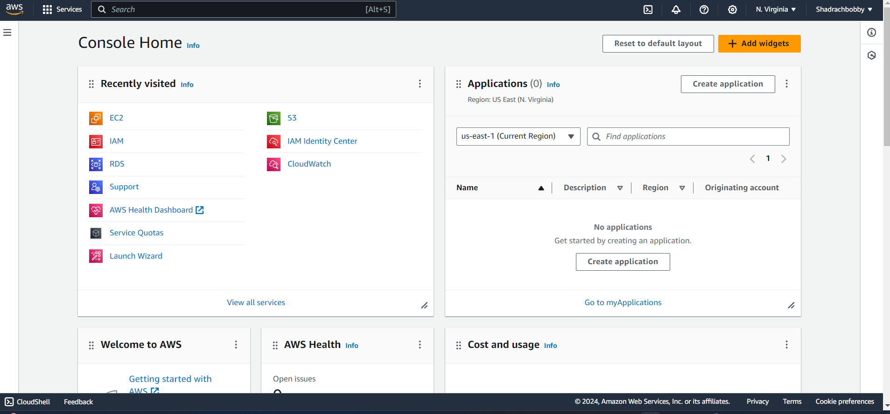
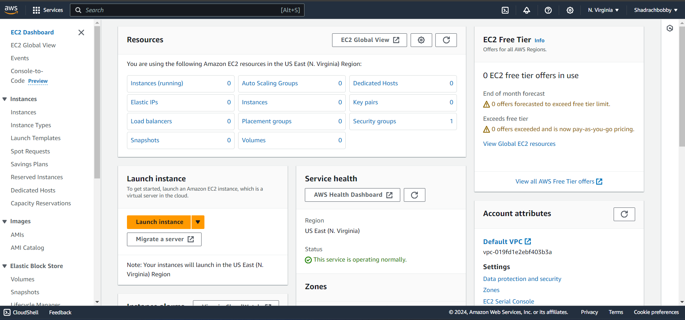
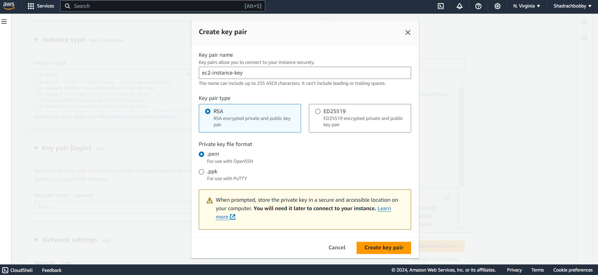
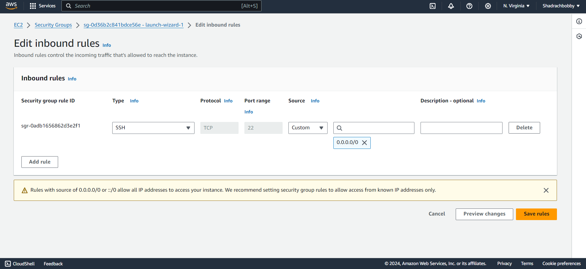
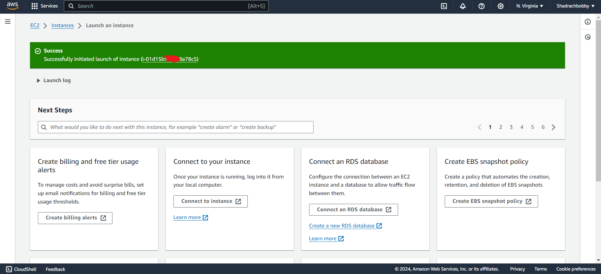
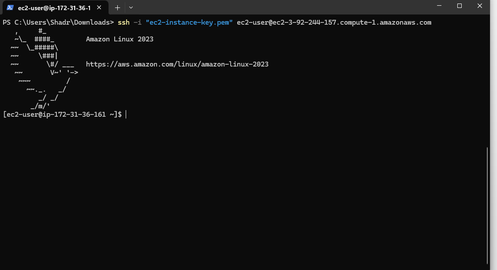

# Create an EC2 Instance

## Skills Demonstrated
- **EC2 Management**: Understanding how to create, configure, and manage Amazon EC2 instances.
- **Instance Types**: Knowledge of different instance types and their use cases.
- **SSH Access**: Securely accessing and managing your instance via SSH.

## Professional Value
This project demonstrates a fundamental skill for any cloud practitioner, essential for deploying and managing applications on AWS.

## Project Overview
This project covers the steps required to create an EC2 instance on AWS, configure it, and access it via SSH.

## Prerequisites
- An AWS account
- AWS CLI installed and configured on your local machine
- An SSH client (e.g., PuTTY, OpenSSH)

## Steps to Create an EC2 Instance

1. **Log in to the AWS Management Console**
   - Navigate to the [AWS Management Console](https://aws.amazon.com/console/).
   - 

2. **Launch an EC2 Instance**
   - Go to the EC2 Dashboard.

   - 

   - Click on "Launch Instance".
   - Choose an Amazon Machine Image (AMI).
   - Select an instance type (e.g., t2.micro for free tier eligible).
   - Configure instance details.
   - Create a new key pair or use an existing one.
   - Download the key pair file (.pem) and keep it safe.
   - 
   - 
   - 
   - Add storage.
   - Add tags.
   - Configure security groups (ensure SSH (port 22) is allowed).

    - 

   - Review and launch.
   
      - 

  

4. **Access the EC2 Instance via SSH**
   - Open your terminal or SSH client.
   - Use the following command to connect (replace `your-key-pair.pem` with your key pair file and `ec2-user@your-ec2-instance-public-dns` with your instance’s public DNS):
     ```sh
     ssh -i "your-key-pair.pem" ec2-user@your-ec2-instance-public-dns
     ```
   - Confirm the connection by typing "yes" when prompted.
 

5. **Using AWS CLI to Manage EC2 Instances**
   - Install and configure AWS CLI.
   - Use AWS CLI commands to manage your EC2 instances.
   - Example command to describe instances:
     ```sh
     aws ec2 describe-instances
     
     ```

       ## Example
   Here is an example command to connect to your EC2 instance:

     ```sh
   ssh -i "my-key-pair.pem" ec2-user@ec2-198-51-100-1.compute-1.amazonaws.com

   - 

   - 


