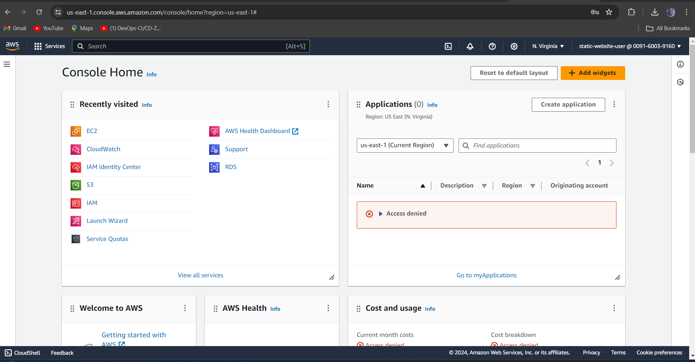
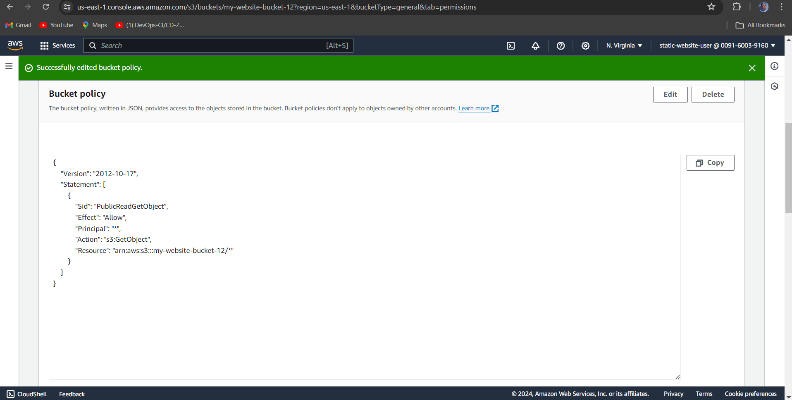
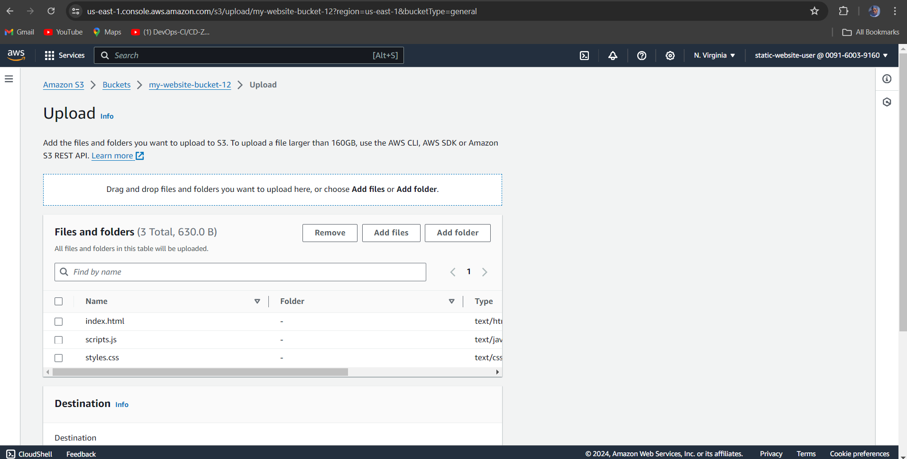

# Static Website on S3

## Aim

The aim of this project is to demonstrate the process of hosting a static website using Amazon S3. This includes setting up an S3 bucket, configuring it for static website hosting, uploading website files, and applying the necessary permissions for public access.

## Importance

Hosting a static website on Amazon S3 is crucial for several reasons:
- **Scalability**: S3 can handle high traffic loads without the need for complex server management.
- **Cost-Effective**: Hosting static websites on S3 is often more affordable compared to traditional web hosting solutions.
- **High Availability**: S3 provides high durability and availability, ensuring that your website remains accessible.
- **Ease of Use**: Simple configuration and management make it an ideal choice for deploying static websites quickly and efficiently.

## Description

This project demonstrates how to host a static website using Amazon S3. It covers creating an S3 bucket, configuring it for static website hosting, uploading files, and setting permissions to allow public access.

## Skills Demonstrated

- Understanding of S3
- Static website hosting
- Basic web development (HTML, CSS, JavaScript)

## Professional Value

This project showcases the ability to deploy simple web solutions on AWS, highlighting essential skills for cloud practitioners.

## Prerequisites

- AWS Account
- Basic knowledge of web development

## Installation and Deployment

### 1. Access S3 with IAM User

1. **Sign In with IAM User**

   

   - Go to the [AWS Management Console](https://aws.amazon.com/console/).
   - Sign in using your IAM user credentials.

2. **Navigate to S3**

   - In the AWS Management Console, type "S3" in the search bar and select S3.

### 2. Create and Configure an S3 Bucket

1. **Create a New S3 Bucket**

   - Click **Create bucket** in the S3 dashboard.
   - Enter a unique bucket name (e.g., `my-website-bucket-12`) and select a region.
   - Click **Next** to proceed through the settings.

2. **Configure Bucket for Static Website Hosting**

   - Go to the **Properties** tab of your bucket.
   - Scroll down to **Static website hosting** and click **Edit**.
   - Enable static website hosting and set the index document to `index.html`.
   - Click **Save** to apply changes.

   

3. **Upload Your Website Files**

   - Go to the **Objects** tab in your bucket.
   - Click **Upload**, select your website files (e.g., `index.html`, `styles.css`, `scripts.js`), and click **Upload**.

   

### 3. Set Bucket Permissions for Public Access

1. **Set Permissions**

   - Go to the **Permissions** tab of your bucket.
   - Scroll down to the **Bucket policy** section and click **Edit**.
   - Add the following policy, replacing `your-bucket-name` with your actual bucket name:

   ```json
   {
       "Version": "2012-10-17",
       "Statement": [
           {
               "Sid": "PublicReadGetObject",
               "Effect": "Allow",
               "Principal": "*",
               "Action": "s3:GetObject",
               "Resource": "arn:aws:s3:::your-bucket-name/*"
           }
       ]
   }


